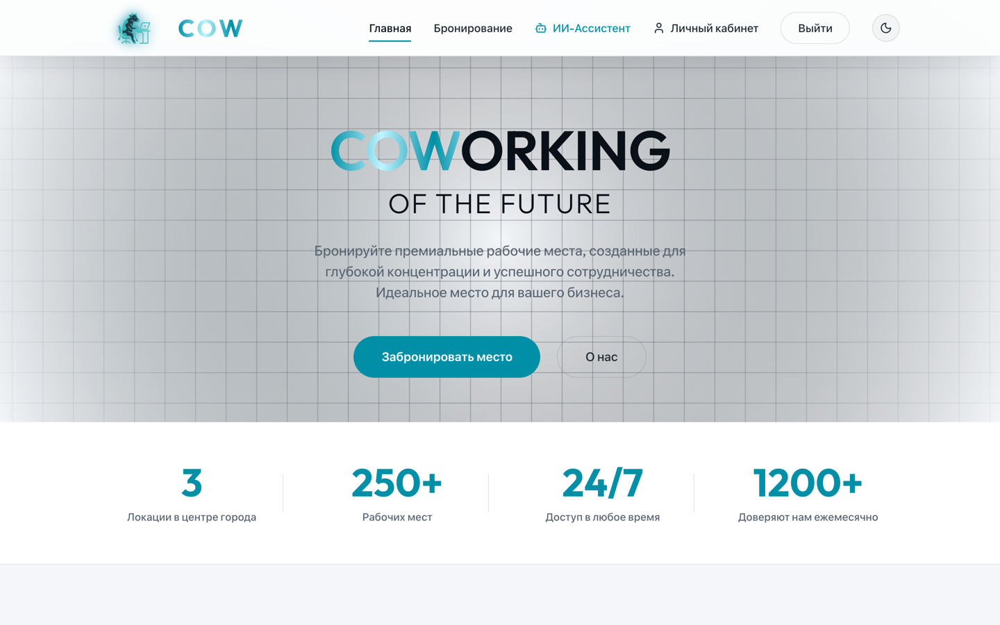
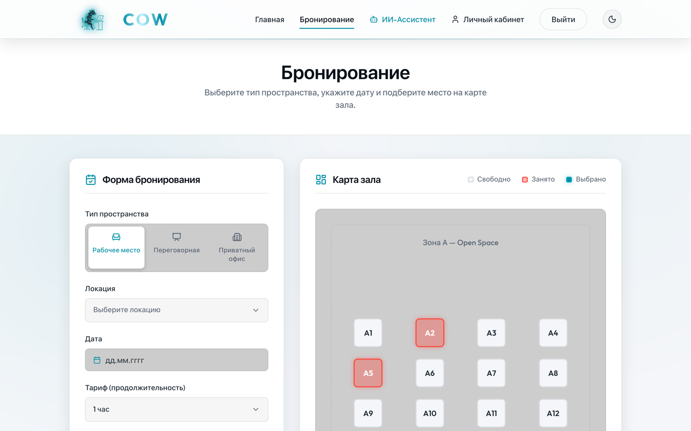
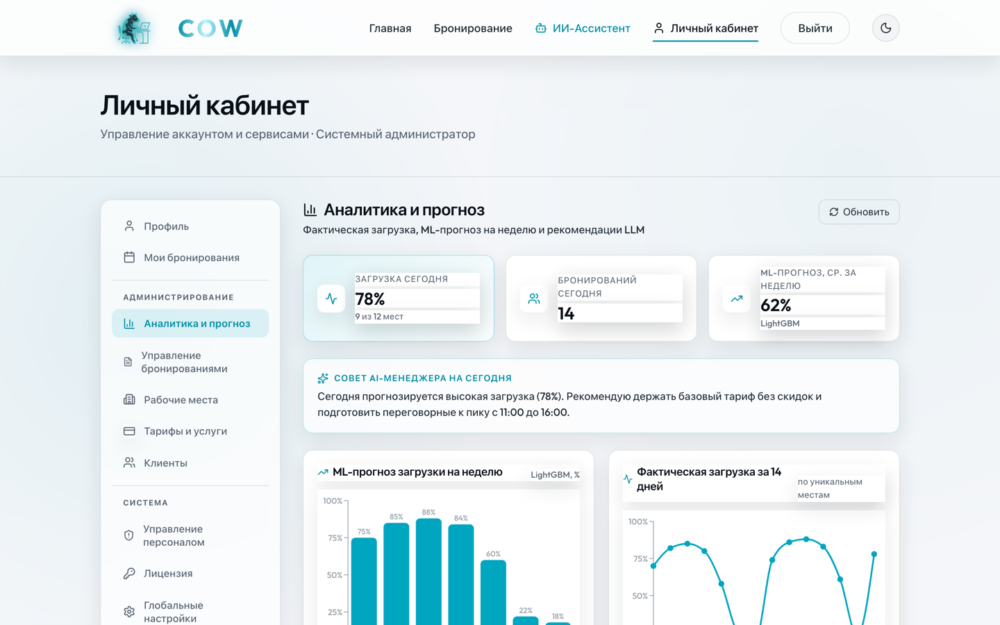
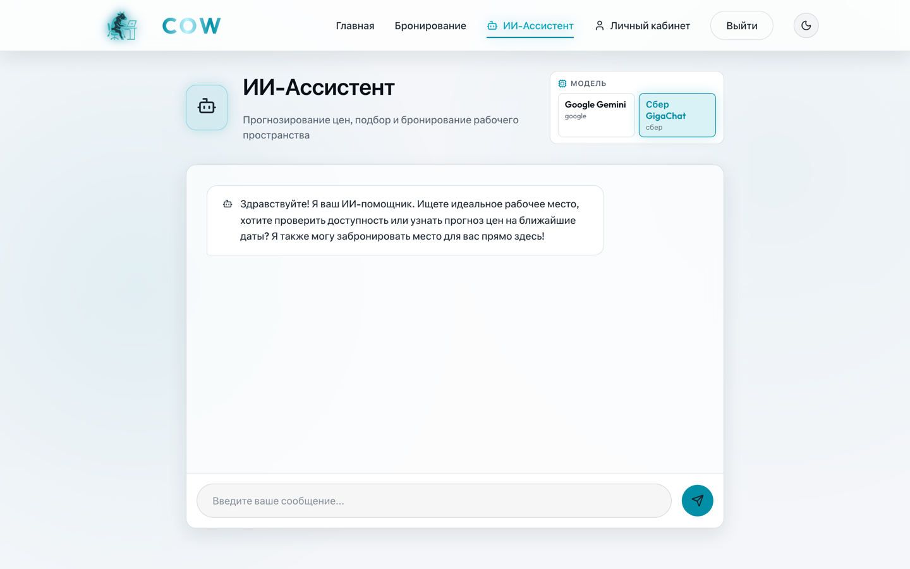

# 🏢 CSBS — Coworking Space Booking System

> Веб-приложение для онлайн-бронирования рабочих мест в коворкинге: каталог мест, бронирование без коллизий, QR-пропуск, email-напоминания, дашборд аналитики с ML-прогнозом загрузки и ИИ-ассистент на выбор из двух LLM.

<p>
  
  
  
  
  
</p>

---

## ✨ Возможности

- **Бронирование без двойных броней** — серверная проверка пересечений интервалов времени.
- **Трёхуровневая ролевая модель** (`user` / `cowork_admin` / `system_admin`) на JWT + middleware проверки ролей.
- **QR-пропуск** для входа — подписанный JWT, действительный до конца брони (рендер на клиенте через `qrcode.react`).
- **Email-напоминания** о ближайшей броне за 24 ч и за 3 ч (фоновый сервис, защита от дублей).
- **Дашборд аналитики** для админов: KPI, фактическая загрузка за 14 дней, ML-прогноз на неделю, распределение по локациям и категориям, текстовая рекомендация LLM.
- **Гибридный ИИ-модуль:** локальная ML-модель (LightGBM) прогнозирует загрузку → LLM генерирует рекомендованную цену и сообщение клиенту. ИИ-ассистент работает на выбор из **Google Gemini** или **Сбер GigaChat**.
- **Event-driven через Apache Kafka** — события `booking.*` публикуются в топик и независимо обрабатываются консьюмерами (нотификации + зеркалирование аудита).
- **Лицензирование платных функций** — офлайн-проверка подписанного JWT (**Ed25519**): без действующего ключа защищённые эндпоинты отвечают `402 Payment Required`.
- **Журнал аудита** действий администраторов.

## 🧱 Архитектура

Слоистая архитектура бэкенда: `Handler → Service → Repository → PostgreSQL`.

```
┌───────────────┐      REST/JWT      ┌─────────────────────────────┐
│ React + Vite  │ ◄────────────────► │  Go API (go-chi)            │
│ (nginx)       │                    │  handlers → services → repo │
└───────────────┘                    └───────┬───────────┬─────────┘
                                             │           │
                               ┌─────────────▼──┐  ┌──────▼────────┐
                               │  PostgreSQL    │  │ Apache Kafka  │
                               │  (GORM)        │  │ booking.events│
                               └────────────────┘  └──────┬────────┘
                                                          │ consumers
   ┌───────────────┐  ┌────────────────┐         ┌────────▼────────┐
   │ LightGBM (ML) │  │ Gemini /        │         │ notifications + │
   │ прогноз загр. │  │ GigaChat (LLM)  │         │ audit-mirror    │
   └───────────────┘  └────────────────┘         └─────────────────┘
```

## 🛠️ Технологический стек

| Слой | Технологии |
|---|---|
| **Backend** | Go 1.23, `go-chi/chi` v5, GORM, JWT (`golang-jwt`), bcrypt |
| **БД** | PostgreSQL 16 |
| **Событийная шина** | Apache Kafka (KRaft), `segmentio/kafka-go` |
| **ML** | LightGBM (обучение на Python), инференс в Go через `dmitryikh/leaves` |
| **LLM** | Google Gemini API, Сбер GigaChat API |
| **Лицензирование** | Подписанный JWT, Ed25519 (`crypto/ed25519`) |
| **Frontend** | React 19, Vite 7, recharts, qrcode.react |
| **Инфраструктура** | Docker (multi-stage), Docker Compose, nginx |

## 🚀 Быстрый старт

### Через Docker Compose (рекомендуется)

```bash
# 1. Подготовить переменные окружения
cp backend/.env.example backend/.env
#    отредактируйте backend/.env (как минимум DB_PASSWORD; ключи LLM/SMTP — опционально)

# 2. Поднять всё окружение: postgres + kafka + backend + frontend
docker compose --env-file backend/.env up --build
```

После старта:
- **Frontend** — http://localhost:3000
- **Backend API** — http://localhost:8080

### Локальный запуск (без Docker)

```bash
# Backend (нужны Go 1.23+ и запущенный PostgreSQL)
cd backend
go run ./cmd/server

# Frontend (нужен Node.js 18+)
cd CSBS-FRONTEND
npm install
npm run dev          # http://localhost:5173
```

> Все секреты читаются из `backend/.env`. В git коммитится только шаблон `backend/.env.example` — реальный `.env` игнорируется.

## ⚙️ Конфигурация

Ключевые переменные окружения (полный список и комментарии — в `backend/.env.example`):

| Переменная | Назначение |
|---|---|
| `DB_HOST`, `DB_PORT`, `DB_USER`, `DB_PASSWORD`, `DB_NAME` | Подключение к PostgreSQL |
| `SERVER_PORT` | Порт HTTP-сервера (по умолчанию `8080`) |
| `GEMINI_API_KEY` | Ключ Google Gemini (ИИ-ассистент, рекомендация цены) |
| `GIGACHAT_AUTH_KEY` | Авторизация Сбер GigaChat (альтернативный LLM) |
| `SMTP_*`, `APP_URL` | Отправка email-напоминаний и ссылок |
| `KAFKA_BROKERS` | Брокеры Kafka. Пусто → событийная шина отключается (graceful degradation) |
| `LICENSE_PUBLIC_KEY`, `LICENSE_KEY` | Лицензирование платных функций (Ed25519) |

Все интеграции спроектированы с **graceful degradation**: при отсутствии ключа LLM / SMTP / Kafka соответствующая функция отключается, а остальное приложение продолжает работать.

## 🧪 Тестирование

```bash
# Backend — unit-тесты
cd backend && go test ./...

# Frontend — unit-тесты (Vitest) и e2e (Playwright)
cd CSBS-FRONTEND
npm run test
npx playwright test
```

## 📁 Структура проекта

```
CSBS/
├── backend/
│   ├── cmd/server/        # точка входа: API + ReminderService + Kafka + лицензии
│   ├── cmd/licensegen/    # утилита вендора: генерация ключей и выпуск лицензий
│   ├── internal/
│   │   ├── api/           # HTTP-обработчики и middleware
│   │   ├── models/        # GORM-модели
│   │   ├── repository/    # доступ к БД
│   │   └── service/       # бизнес-логика
│   └── pkg/               # gemini, gigachat, kafka, license, email, logger
├── CSBS-FRONTEND/         # React + Vite (nginx в проде)
├── ml/train_model.py      # обучение LightGBM-модели
└── docker-compose.yml     # postgres + kafka + backend + frontend + backup
```

## 📸 Скриншоты

| Главная | Бронирование |
|---|---|
|  |  |
| **Дашборд аналитики** | **ИИ-ассистент** |
|  |  |

---

<sub>Pet-проект. Демонстрирует полный цикл: слоистый Go-бэкенд, React-фронтенд, событийную архитектуру на Kafka, интеграцию ML + LLM и контейнеризацию.</sub>
